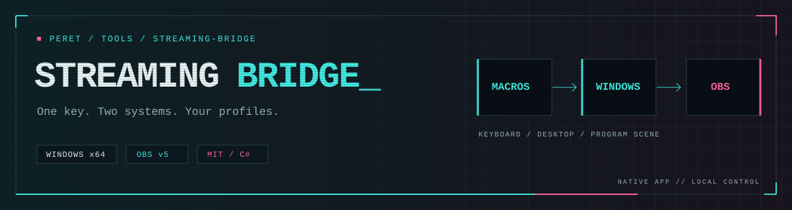
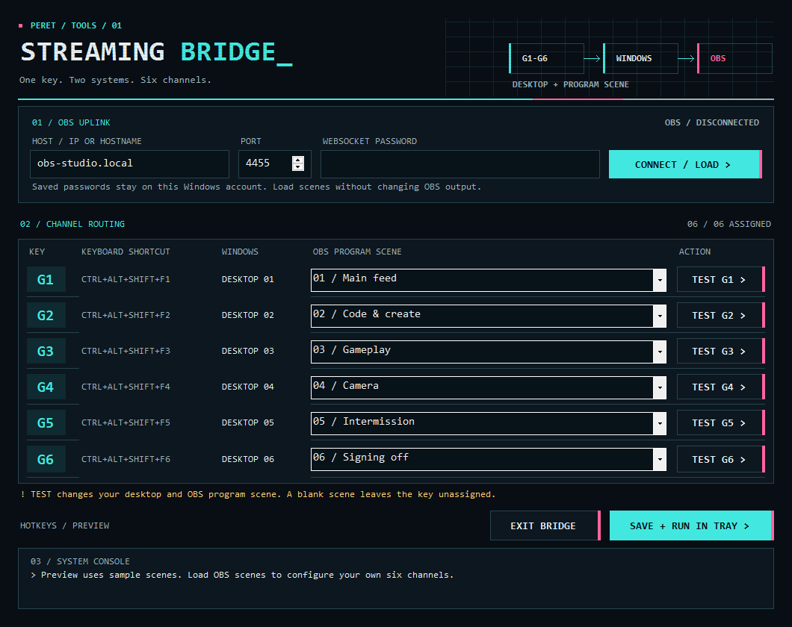
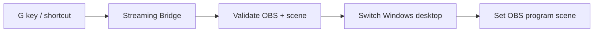

<p align="center">
  
</p>

# Streaming Bridge

**Your workspace and your broadcast, on the same key.**

A native Windows tray app that maps six keyboard shortcuts to numbered virtual desktops and OBS program scenes. Built for Corsair G keys and dual-machine streaming setups; works with any keyboard or macro pad that can send the shortcuts.

Retro terminal styling. Cyan routing, magenta accents, a quiet CRT grid. No Python, Streamer.bot, or background web server required.

<p align="center">
  
</p>

*App preview rendered from the actual WinForms controls with sample data. No saved credentials, real network addresses, or personal scene names are used.*

## What it does

- **One key, two actions.** Select Desktop 1–6, then the exact OBS program scene assigned to it.
- **Check before switching.** Validate the OBS connection and scene name before changing your desktop.
- **Keep the last press.** If shortcuts arrive while an operation is running, the newest pending key wins.
- **Keep credentials local.** Save the OBS password using Windows DPAPI for the current Windows account.
- **Stay in the tray.** Close settings to keep the bridge running; use the tray menu to configure, test, or exit.

## Build and run

Requirements: Windows 11 with a compatible virtual desktop helper, the Windows .NET Framework compiler, and OBS with its WebSocket v5 server enabled. The included helper targets the Windows 11 24H2 shell interfaces; Windows updates can change compatibility.

From the repository directory:

```powershell
powershell.exe -NoProfile -ExecutionPolicy Bypass -File .\build.ps1
.\StreamingBridge.exe --settings
```

The build compiles the app **and** the desktop helper from source. It downloads no packages. Exit an already-running bridge from its tray menu before rebuilding its executable, or build separately with `-OutputDirectory .\artifacts\app`.

1. In OBS, open **Tools → WebSocket Server Settings** and enable the server.
2. Enter the OBS computer's hostname or IP address, its port (default `4455`), and its password. For OBS on this computer, use `localhost`.
3. Select **Connect / load** to fetch scenes. This does not change OBS output.
4. Assign an exact scene to each key. A blank scene leaves that key unassigned.
5. Select **Save + run in tray**. Double-click the tray icon to open settings again.

The bridge uses `ws://` on a trusted LAN. DPAPI protects the saved password on disk; it does not encrypt WebSocket traffic. Connecting and loading scenes are read-only. **Test** and hotkeys change the actual desktop and OBS program scene.

## Keyboard routing

| Key | Shortcut | Windows target |
| --- | --- | --- |
| G1 | Ctrl+Alt+Shift+F1 | Desktop 1 |
| G2 | Ctrl+Alt+Shift+F2 | Desktop 2 |
| G3 | Ctrl+Alt+Shift+F3 | Desktop 3 |
| G4 | Ctrl+Alt+Shift+F4 | Desktop 4 |
| G5 | Ctrl+Alt+Shift+F5 | Desktop 5 |
| G6 | Ctrl+Alt+Shift+F6 | Desktop 6 |

Assign these shortcuts in iCUE or your macro pad software. For Corsair K100 onboard recording, exit the bridge while recording so the shortcut does not trigger an action. Follow [Corsair's recording instructions](https://help.corsair.com/hc/en-us/articles/360050055212-How-to-Set-up-the-iCUE-control-wheel-of-your-K100-RGB-keyboard), and use the hardware profile where you saved the macros. If iCUE overrides onboard settings, configure its active profile too.

Create the required desktops with **Win+Tab**, or run:

```powershell
powershell.exe -NoProfile -ExecutionPolicy Bypass -File .\setup-desktops.ps1
```

This creates missing desktops up to six without deleting or renaming existing ones. Desktop numbers follow their order in Task View; reordering or deleting a desktop changes what its number selects. Manual desktop changes do not automatically change OBS scenes.

## How a press travels



Desktop and OBS changes are sequential, not frame-synchronized or atomic. If OBS fails after the desktop switches, the console reports the partial result. The hotkeys use saved mappings; the window's **Test** buttons use the fields currently shown.

## Local files and publication checks

`config.json` contains your host, scene mappings, and DPAPI-encrypted password. `status.json` and `bridge.log` can contain connection details and scene names. All three, their temporary/backup copies, generated binaries, build folders, and credential files are excluded from Git.

Install the repository's guards once per clone:

```powershell
powershell.exe -NoProfile -ExecutionPolicy Bypass -File .\scripts\install-hooks.ps1
```

The pre-commit hook checks the staged snapshot. The pre-push hook checks all reachable history, including files removed in later commits. They block private runtime files, common credential patterns, local network addresses, and personal home paths, reporting only file names and rule names.

Run the same checks manually:

```powershell
powershell.exe -NoProfile -ExecutionPolicy Bypass -File .\scripts\check-repository.ps1 -Staged
powershell.exe -NoProfile -ExecutionPolicy Bypass -File .\scripts\check-repository.ps1 -History
```

These are targeted guards, not a guarantee that every possible secret can be detected. Review the staged diff before publishing. `git archive` includes committed source and showcase assets; it excludes your ignored local files.

## Development and verification

```powershell
powershell.exe -NoProfile -ExecutionPolicy Bypass -File .\test.ps1
powershell.exe -NoProfile -ExecutionPolicy Bypass -File .\scripts\test-repository-check.ps1
powershell.exe -NoProfile -ExecutionPolicy Bypass -File .\scripts\render-preview.ps1
```

Tests cover encrypted settings, password redaction, preview isolation, fragmented WebSocket messages, authentication, timeouts, and publication guards. They use sample data and mock transports; no live OBS request or desktop switch is needed. DPAPI tests must run under a normal Windows user account with its profile loaded.

GitHub Actions builds both programs and runs these checks on a Windows runner. The sample preview is generated from the same UI code as the app.

Build a distributable without your local settings:

```powershell
powershell.exe -NoProfile -ExecutionPolicy Bypass -File .\scripts\package.ps1
```

The ZIP contains only the app, its desktop helper, licenses, and a quick-start guide. Packaging uses a new staging folder and an explicit file list.

## Troubleshooting

| Symptom | Check |
| --- | --- |
| Connection refused or timed out | OBS is running, its WebSocket server is enabled, and both computers can reach each other through the firewall. |
| Authentication failed | Re-enter the current password from OBS WebSocket Server Settings. |
| G key does nothing | Try its full keyboard shortcut directly; then check the active macro profile and any reported hotkey conflict. |
| Desktop does not exist | Create it in Win+Tab or run `setup-desktops.ps1`. |
| Switching broke after a Windows update | Review or update the version-specific helper; see [desktop notes](desktop/README.md). |

For an independent, read-only OBS authentication check, see [diagnostics](diagnostics/README.md). Keep a remote OBS computer awake and use a stable LAN hostname or DHCP reservation.

## Credits and license

Created by [Christopher Peret](https://www.chrisperet.net/). Visual direction draws from the terminal language of that portfolio and the cyan/magenta transmission panels of [Top Quark Studios](https://tqstudios.dev/).

The bridge is [MIT licensed](LICENSE). The vendored desktop helper is Markus Scholtes's [VirtualDesktop](https://github.com/MScholtes/VirtualDesktop), with its original [MIT notice](desktop/LICENSE.VirtualDesktop). OBS protocol reference: [obs-websocket v5](https://github.com/obsproject/obs-websocket/blob/master/docs/generated/protocol.md).
