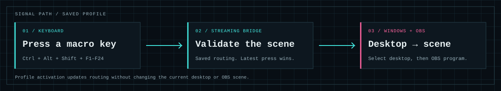
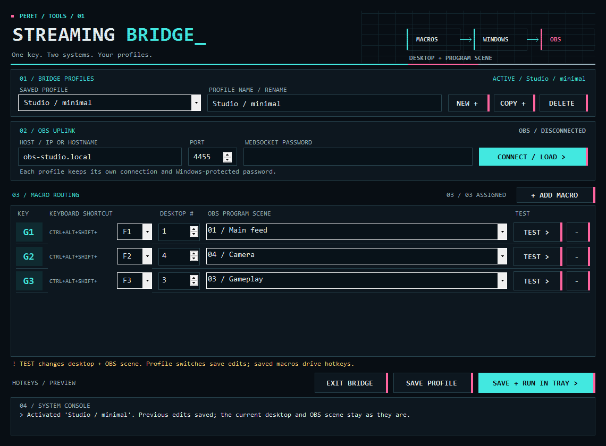

<p align="center">
  
</p>

<h1 align="center">Streaming Bridge</h1>

<p align="center">
  <strong>Your workspace and your broadcast, on the same key.</strong><br>
  A native Windows tray app for routing macro keys to virtual desktops and OBS scenes.
</p>

<p align="center">
  <a href="https://github.com/Zed-CSP/macroBridge/actions/workflows/checks.yml"></a>
  
  
  <a href="LICENSE"></a>
</p>

<p align="center">
  <a href="#quick-start">Quick start</a> ·
  <a href="docs/CONFIGURATION.md">Configuration guide</a> ·
  <a href="CONTRIBUTING.md">Contributing</a> ·
  <a href="https://github.com/Zed-CSP/macroBridge/issues">Report an issue</a>
</p>

## One shortcut, two systems

Keep your Windows workspace and OBS program scene on the same macro key. Build different routing profiles for streaming, recording, or studio work, then switch between them from the app or system tray.

Designed for Corsair G keys, keyboards, and macro pads that can send **Ctrl+Alt+Shift+F1–F24**. The interface combines a dark terminal palette, cyan routing controls, magenta accents, and a quiet retro grid.

<p align="center">
  
</p>

<p align="center"><sub>Actual application controls, rendered off screen with sample data. Screenshots contain no personal settings or credentials.</sub></p>

## Features

| Capability | Behavior |
| --- | --- |
| **Configurable macros** | Add or remove up to 24 macros per profile. Choose each shortcut, desktop number, and exact OBS scene independently. |
| **Saved profiles** | Create, copy, rename, delete, and activate complete setups. Each retains its own OBS connection and encrypted password. |
| **Checked routing** | Verify the OBS connection and assigned scene before switching desktops. Report partial failures in the console. |
| **Latest press wins** | Keep the newest pending shortcut while an operation is running. Discard queued presses when profiles change. |
| **Local credential storage** | Protect saved passwords with Windows DPAPI for the current Windows account. |
| **Native tray operation** | Keep running when settings close. Configure, switch profiles, test saved macros, or exit from the tray. |
| **Offline core build** | Compile the app and included desktop helper with the Windows .NET Framework compiler. No package download is required. |

## How routing works

<p align="center">
  
</p>

Hotkeys use the active profile's **saved** mappings. The editor's **Test** buttons use the fields currently shown. Desktop and OBS changes happen sequentially; they are not an atomic operation. Manual desktop changes do not automatically change OBS scenes.

## Quick start

**Requirements:** Windows 11, OBS with its WebSocket v5 server enabled, Git, and the Windows .NET Framework compiler. The included desktop helper targets the **Windows 11 24H2 shell interfaces**; compatibility can change after a Windows update. See the [desktop helper notes](desktop/README.md).

### 1. Clone and build

```powershell
git clone https://github.com/Zed-CSP/macroBridge.git
cd macroBridge
powershell.exe -NoProfile -ExecutionPolicy Bypass -File .\build.ps1
.\StreamingBridge.exe --settings
```

The build produces the app and its desktop helper locally. Generated programs and build output are ignored by Git. Exit an already-running bridge before rebuilding its executable.

### 2. Configure OBS and your macros

1. In OBS, enable **Tools → WebSocket Server Settings → Enable WebSocket server**.
2. Enter the OBS computer's hostname or IP address, port (default **4455**), and password. Use **localhost** when OBS runs on this PC.
3. Select **Connect / load** to fetch the available scenes.
4. Choose a shortcut, desktop number, and scene for each macro. Use **+ Add macro** and the row's **−** button to change the number of rows.
5. Configure your keyboard or macro pad to send the shortcuts shown in the editor.
6. Select **Save profile** to activate your edits, or **Save + run in tray** to save and close settings.

Create the target desktops in **Win+Tab** first. Connecting and loading scenes are read-only; **Test** and hotkeys change the actual Windows desktop and OBS program scene.

### 3. Save different setups

Use **New +** for an empty profile, **Copy +** to duplicate a setup, and the name field to rename it. Select a saved profile from the window or tray to activate it. Switching saves the outgoing edits and updates hotkeys without changing the current desktop or OBS scene.

An older six-key configuration is preserved as **Original setup**, with an exact local backup. See [profiles and migration](docs/CONFIGURATION.md#profiles-and-migration) for details.

<details>
<summary><strong>See an alternate profile</strong></summary>

<br>


*Profiles can use different numbers of macros and different desktop targets. This image uses sample data.*

</details>

## Configuration and troubleshooting

The [configuration guide](docs/CONFIGURATION.md) covers default shortcuts, desktop numbering, Corsair/iCUE setup, profile behavior, credential storage, and common problems.

- [Quick-start guide](docs/QUICKSTART.md) — compact setup instructions.
- [Desktop helper](desktop/README.md) — shell compatibility and upstream licensing.
- [OBS diagnostic](diagnostics/README.md) — optional read-only authentication and scene-list check.

## Development

```powershell
powershell.exe -NoProfile -ExecutionPolicy Bypass -File .\scripts\install-hooks.ps1
powershell.exe -NoProfile -ExecutionPolicy Bypass -File .\build.ps1 -OutputDirectory .\artifacts\app
powershell.exe -NoProfile -ExecutionPolicy Bypass -File .\test.ps1
powershell.exe -NoProfile -ExecutionPolicy Bypass -File .\scripts\test-repository-check.ps1
```

GitHub Actions builds both programs and runs the offline checks on Windows. Tests cover profile migration, exact backups, macro editing, profile switching, encrypted credentials, preview isolation, WebSocket authentication, fragmentation, timeouts, and publication guards. They use sample settings and mock transports; no live OBS request or desktop switch is required.

See [CONTRIBUTING.md](CONTRIBUTING.md) for the source layout, visual preview workflow, and development conventions.

## What belongs in this repository

This repository contains source code, documentation, licenses, and intentional showcase images. Personal profiles, connection settings, encrypted credentials, runtime reports, backups, compiled programs, dependency output, test output, and ZIP packages are excluded.

The pre-commit guard checks the staged snapshot. The pre-push guard checks all reachable history, including removed files. Both report file names and rule names without echoing detected secrets. Run the complete audit before publishing:

```powershell
powershell.exe -NoProfile -ExecutionPolicy Bypass -File .\scripts\check-repository.ps1 -History
```

The guards detect common credential patterns and private files; review your changes before sharing. Build and packaging output stays local.

## Credits and license

Created by [Christopher Peret](https://www.chrisperet.net/). The visual direction draws from his portfolio and the terminal-inspired cyan/magenta panels of [Top Quark Studios](https://tqstudios.dev/).

Streaming Bridge is [MIT licensed](LICENSE). The included desktop helper is Markus Scholtes's [VirtualDesktop](https://github.com/MScholtes/VirtualDesktop), with its original [MIT notice](desktop/LICENSE.VirtualDesktop). OBS protocol reference: [obs-websocket v5](https://github.com/obsproject/obs-websocket/blob/master/docs/generated/protocol.md).
